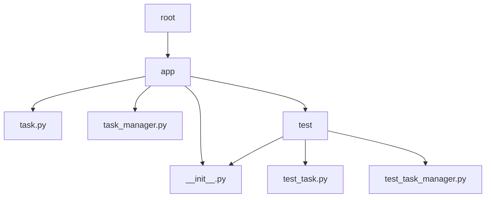

# Pruebas con Pytest

Pytest es un paquete que se va a instalar utilizando PIP, como buena práctica se debe crear un entorno virtual para trabajar sobre ese entorno
```sh
cd pytest_example
python -m virtualenv venv
```
En caso de no tener el módulo "virtualenv" se tiene que instalarlo y después ejecutar la creación del "venv"
```sh
pip install virtualenv
cd pytest_example
python -m virtualenv venv
```
Una vez creado el virtualenv "venv" se activa para instalar Pytest
```sh
# Para linux
source venv/bin/activate
```
```powershell
# Para Windows con PowerShell
.\venv\Scripts\activate.ps1
```
Una vez activado el entorno se mostrará en la terminal de la siguiente manera
```sh
(venv) $
```
Para desactivar el entorno virtual ejecutar en Windows y Linux
```sh
deactivate
```

## Instalación de Pytest
Para instalar Pytest utilizar el comando desde el entorno virtual (venv)
```sh
pip install pytest
```
## Ejecución de Pytest
Después de su instalación ya esta lista para utilizar
```sh
cd pytest_example
source venv/bin/activate
# .\venv\Scripts\activate.ps1
pytest
# para mas detalles utilizar el argumento -v 
pytest -v
```
El comando "pytest" ejecutará todos los módulos con prefijo "test_" de forma automática
Las clases y funciones para pruebas deben empezar obligatoriamente con el prefijo "test"
Para ejecutar pruebas en especifico ejecutar como "test_resta_dos_numeros" de la clase "TestExample"
```sh
pytest test_main.py::TestExample::test_resta_dos_numeros -v
```
Para ejecutar todas las pruebas de solo la clase "TestExample2"
```sh
pytest test_main.py::TestExample2 -v
```
El setup y teardown se ejecuta antes de cada prueba y sirve para definir contenido y limpiar objetos
para visualizar los outputs como el print se tiene que utilizar el argumento -s
setup_class y teardown_class permite ejecutar pruebas antes y después de todas las pruebas
```sh
pytest -s
```
## Ejecución de un proyecto "app"
El proyecto cuenta con la estructura 

Para ejecutar solo los test de app se utiliza
```sh
pytest app/test
```
Para ejecutar las pruebas exclusivamente de test_task.py
```sh
pytest app/test/test_task.py 
```
Se puede asignar etiquetas, marcas y categorizar las pruebas con pytest para ejecutar solo las marcadas,
crear el archivo "pytest.ini" donde se define la etiqueta y después se asigna las etiquetas como por ejemplo: "@pytest.mark.due_date", 
una prueba puede poseer multiples marcas
Para ejecutar solo los test con la etiquetas "due_date"
```sh
pytest app/test/test_task.py -v -m due_date
```

Se puede saltar tests de 3 Formas diferentes
- skip -> Salta automáticamente el test
- skipif -> Salta las pruebas si cumplen una condición (true)


### Fixture
El uso de Fixture permite asignar valores a las pruebas generalmente de tipo funciones "test_username" en "test_task.py"
la función fixture debe tener el mismo nombre que el parámetro a llenar
Ejecutar para visualizar el print de username en "test_username"
```sh
pytest app/test/test_task.py  -v -s 
```
Si se cambia el "return" por "yield" sirve para emular el setup y el teardown, esto es mostrado en "username2"

### Parametrizar pruebas
Se puede parametrizar las pruebas para flexibilizar las pruebas y se parametriza con un string definiendo los valores y un listado de tuplas que almacena los valores a probar por cada tupla se ejecuta una prueba, se visualiza en "test_new_task_parametrize" que tiene la etiqueta "@pytest.mark.parametrize"
```sh
pytest app/test/test_task.py  -v
```